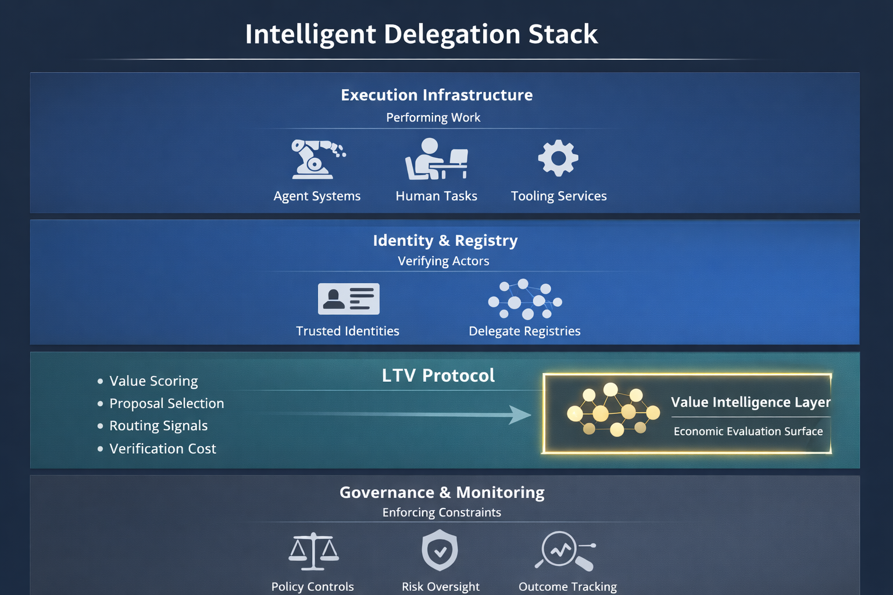

# LTV Protocol

Canonical Value Intelligence Infrastructure  
for Agentic Commerce and Machine Economies

LTV is a value-metric layer for intelligent delegation — enabling agents to evaluate, route, and govern economic work under cost, risk, and verification constraints.

---

## Overview

The LTV Protocol defines interoperable schemas and routing primitives for Lifetime Value (LTV) within autonomous commerce, agentic systems, and machine-mediated economic networks.

As execution infrastructure becomes abundant, economic evaluation becomes scarce.

The LTV Protocol establishes value as:

- Routable  
- Auditable  
- Verifiable  
- Institutionally alignable  

It functions as a canonical specification stewarded under the **LTV.COM namespace registry**, providing a coordination surface for value intelligence across heterogeneous platforms.

---

## Intelligent Delegation Context

Modern agent systems no longer simply execute tasks — they **delegate** work across humans, tools, and other agents.

Delegation introduces structured decision surfaces:

- Execution cost  
- Verification cost  
- Risk exposure  
- Duration and reversibility  
- Compliance constraints  
- Outcome criticality  

Execution answers *how*.  
Delegation requires answering *whether*.

The LTV Protocol provides the economic reasoning layer that informs delegation decisions.

---

## Delegation Stack Mapping

| Delegation Layer | Infrastructure Role | LTV Contribution |
|------------------|--------------------|------------------|
| Task evaluation | Compare expected outcomes | Value-weight scoring |
| Proposal selection | Rank candidate plans | Predictive value attribution |
| Delegatee routing | Select execution entity | Deterministic routing signals |
| Registry lookup | Identity mapping | Canonical namespace surface |
| Market bidding | Economic competition | Comparable valuation metrics |
| Monitoring & enforcement | Outcome tracking | Value-aligned telemetry |
| Verification allocation | Proof vs cost tradeoff | Value-adjusted verification |

LTV does not perform execution.  
It informs where execution should flow.

---

## Scope

The protocol defines interoperable infrastructure for:

- Lifetime Value computation schemas  
- Predictive signal ingestion frameworks  
- Delegation-aware routing orchestration  
- Governance and transparency primitives  
- Identity trust lifecycle controls  

### Heterogeneous Value Signals

The LTV Protocol supports heterogeneous economic signals including:

- Commerce Lifetime Value estimates  
- Subscription revenue projections  
- Credit and underwriting metrics  
- DeFi Loan-to-Value ratios  
- Risk-adjusted economic signals  

The protocol does not standardize proprietary valuation models.  
It standardizes the interface through which value intelligence is exchanged.

---

## Architecture Overview

The LTV Protocol spans multiple infrastructure layers within agent-driven economic systems.

### 1. Execution Infrastructure
Performs work.

- Agent systems  
- Human operators  
- Tooling services  

### 2. Identity & Registry
Verifies actors.

- Trusted identities  
- Delegate registries  
- Namespace coordination  

### 3. Value Intelligence Layer (LTV)
Evaluates economic worth.

- Value scoring  
- Proposal selection  
- Routing signals  
- Verification economics  

### 4. Governance & Monitoring
Enforces constraints.

- Policy controls  
- Risk oversight  
- Outcome tracking  

---

## Delegation-Aware Threat Model

Delegation infrastructure operates under adversarial conditions.

Value routing policies must remain resilient against:

- Prompt injection into delegated tools  
- Identity spoofing and Sybil attacks  
- Reputation manipulation  
- Collusive bidding behavior  
- Metric gaming  
- Fabricated or unverifiable outputs  

The LTV governance layer supports trust-aware routing and telemetry alignment under these conditions.

---

## Releases

- **v1.1-alpha (Latest)** — Governance & Safety Patch → `/governance`  
- **v1.0-alpha** — Core Specification → `/openapi`  

---

## Repository Structure

`/openapi` — Protocol interface & computation schemas  
`/governance` — Trust, policy, and transparency specifications  
`/spec` — Conceptual specification documents  
`/docs` — Research and contextual alignment materials  

Key governance artifacts include:

- Transparency log commitments  
- Incident response framework  
- Policy oversight definitions  
- Identity lifecycle controls  

---

## Registry & Namespace

The LTV.COM Registry functions as a coordination surface for value signaling constructs.

It provides:

- Canonical reference definitions  
- Collision-resistant namespace identity  
- Provider-neutral routing interfaces  
- Cross-ecosystem semantic alignment  

The registry does not impose proprietary valuation logic.  
It enables interoperable value signaling.

---

## Conceptual Positioning

The LTV Protocol:

Does NOT:
- Define proprietary financial scoring algorithms  
- Replace institutional underwriting systems  
- Custody or compute raw transaction data  

Does:
- Provide interoperable value interfaces  
- Enable delegation-aware economic routing  
- Support auditable and verifiable value exchange  

Value computation remains institution-specific.  
Value signaling becomes interoperable.

---

## Status

Draft — Alpha stage protocol development.

Open for ecosystem feedback, research alignment, and exploratory institutional review.

---

## Research Context

Conceptual foundations are explored in:

**The Missing Value Layer in Agent Commerce — Toward a Value Intelligence Stack**

https://medium.com/@caihexuan/the-missing-value-layer-in-agent-commerce-072be8a9a2fa

Additional alignment material:

`/docs/delegation-alignment.md`

---

## Infrastructure Positioning

The LTV Protocol functions as foundational infrastructure across:

- AI commerce systems  
- Subscription economies  
- Credit and underwriting environments  
- Advertising value optimization  
- Delegated execution markets  
- Agent-mediated transaction networks  
- Decentralized leverage infrastructures  

It is designed to evolve toward governance-aligned, auditable adoption within machine-driven economic systems.

---

## Repository

https://github.com/LTVLABS/ltv-protocol
